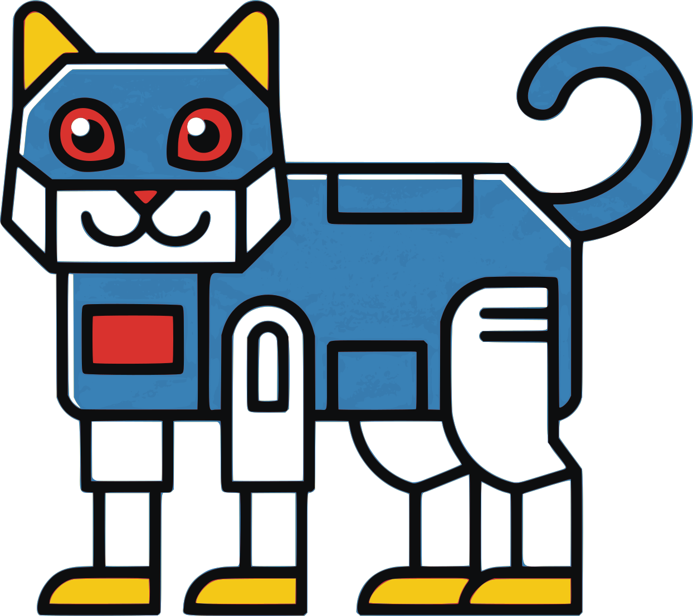

# Robot



Unified Python interface for CLI-based coding agents.

## Overview

Robot provides a consistent API for invoking AI coding assistants in headless mode:

- Claude Code (`claude`) - Anthropic's coding agent
- OpenAI Codex (`codex`) - OpenAI's coding agent
- Gemini CLI (`gemini`) - Google's coding agent
- Mistral Vibe (`vibe`) - Mistral's coding agent
- Aider (`aider`) - Open source AI pair programming
- OpenRouter (`openrouter`) - Access any model via OpenRouter API
- Z.ai (`zai`) - Access GLM-4.7 and other models via Z.ai

## Installation

```bash
pip install -e .
```

Or install from the repository:

```bash
pip install git+https://github.com/philiporange/robot.git
```

## Quick Start

```python
from robot import Robot

# Run with default agent (Claude)
response = Robot.run("Explain what this code does")

# Use a specific agent
response = Robot.run("Review this code", agent="claude", model="sonnet")

# Use OpenRouter to access any model
response = Robot.run("Fix this bug", agent="openrouter", model="deepseek")

# Run a predefined task
response = Robot.run_task("readme", working_dir="/path/to/project")
```

## CLI Usage

```bash
# Start interactive mode (default) - uses Claude with Opus
robot

# Interactive mode with specific model (auto-selects agent)
robot -m sonnet
robot -m gpt-4o    # Uses codex agent
robot -m gemini-3-pro-preview  # Uses gemini agent

# Run a single prompt
robot run "Explain this code" --agent claude

# Use OpenRouter with any model
robot run "Review this code" --agent openrouter --model minimax

# Run a task
robot task readme --dir /path/to/project

# List available agents
robot list

# Check if an agent is installed
robot check claude
```

## Interactive Mode

Running `robot` with no arguments starts an interactive TUI session:

```
╭─────────────────────────────────────────╮
│           Robot Interactive Mode        │
╰─────────────────────────────────────────╯
  Agent: claude  Model: opus

>>> Write a hello world function
```

### Interactive Commands

| Command | Description |
|---------|-------------|
| `/agent <name>` | Switch agent (claude, codex, gemini, vibe, aider, openrouter) |
| `/model <name>` | Switch model (auto-selects appropriate agent) |
| `/super` | Toggle superagent mode |
| `/dir <path>` | Change working directory |
| `/status` | Show current settings |
| `/help` | Show available commands |
| `/quit` | Exit interactive mode |

### Multi-line Input

- End a line with `\` to continue on the next line
- Use triple quotes `"""` for multi-line blocks

## Configuration

### Environment Variables

```bash
# Default settings
ROBOT_DEFAULT_AGENT=claude
ROBOT_DEFAULT_TIMEOUT=180
ROBOT_PROMPTS_DIR=~/.robot/prompts

# Claude API (supports custom endpoints like z.ai)
ROBOT_CLAUDE_API_KEY=your-key
ROBOT_CLAUDE_BASE_URL=https://api.z.ai/api/anthropic

# OpenAI/Codex API
ROBOT_CODEX_API_KEY=your-key
ROBOT_CODEX_BASE_URL=https://api.openai.com/v1

# Gemini API
ROBOT_GEMINI_API_KEY=your-key

# Mistral/Vibe API
ROBOT_VIBE_API_KEY=your-key

# OpenRouter API
ROBOT_OPENROUTER_API_KEY=your-key
OPENROUTER_API_KEY=your-key  # Also supported
```

### Programmatic Configuration

```python
from robot import Robot
from robot.base import AgentConfig

# Configure custom API endpoint
config = AgentConfig(
    api_key="your-api-key",
    base_url="https://api.z.ai/api/anthropic",
    model="sonnet",
)
agent = Robot.get("claude", config=config)
response = agent.run("Hello world")
```

## Session Resume / History

Save costs by resuming previous conversations with cached context.

### Claude Sessions

```python
from robot import Robot
from robot.base import AgentConfig

# Continue most recent session
config = AgentConfig(resume=True)
response = Robot.run("Continue where we left off", agent="claude", config=config)

# Resume specific session by ID
config = AgentConfig(session_id="abc123")
response = Robot.run("Continue this session", agent="claude", config=config)
```

### Aider/OpenRouter History Files

```python
from robot import Robot
from robot.base import AgentConfig
from pathlib import Path

# Store chat history in a file
# Automatically resumes if file exists
config = AgentConfig(history_file=Path("/tmp/my_project_chat.md"))
response = Robot.run("Continue coding", agent="openrouter", config=config)
```

## OpenRouter Models

Access any model through OpenRouter with convenient aliases:

| Alias | Model |
|-------|-------|
| `minimax` | minimax/minimax-m2.1 (default) |
| `claude` | anthropic/claude-sonnet-4 |
| `opus` | anthropic/claude-opus-4 |
| `gpt5` | openai/gpt-5.2 |
| `gpt4` | openai/gpt-4o |
| `llama` | meta-llama/llama-3.3-70b-instruct |
| `deepseek` | deepseek/deepseek-chat |
| `gemini` | google/gemini-3-pro-preview |
| `qwen` | qwen/qwen-2.5-72b-instruct |

Or use any OpenRouter model directly:

```python
response = Robot.run("Hello", agent="openrouter", model="anthropic/claude-sonnet-4")
```

## YAML Prompts

Define reusable prompts in YAML:

```yaml
# ~/.robot/prompts/tasks/review.yaml
name: review
description: Code review

models:
  claude: sonnet
  codex: o4-mini

system: |
  You are an experienced code reviewer.

prompt: |
  Review {target} for bugs and issues.

variables:
  target: "this codebase"
```

## Agent Capabilities

| Agent | Tools | Streaming | System Prompt | Resume |
|-------|-------|-----------|---------------|--------|
| claude | Yes | Yes | Yes | Yes |
| codex | Yes | No | No | Yes |
| gemini | Yes | Yes | Yes* | Yes |
| vibe | No | Yes | No | Yes |
| aider | No | Yes | No | Yes |
| openrouter | No | Yes | No | Yes |
| zai | No | Yes | No | Yes |

*Gemini system prompts are set via a temp file and the `GEMINI_SYSTEM_MD` environment variable.

All agents now support session resume for cached context savings.

## Superagent Mode

Superagents can spawn up to 5 subagents to handle complex multi-step tasks. The superagent orchestrates the work and verifies subagent outputs.

### CLI Usage

```bash
# Run as a superagent (can spawn subagents)
robot run "Refactor this codebase and add tests" --superagent --agent claude

# Customize subagent limits
robot run "Complex task" --superagent --max-subagents 3 --subagent-timeout 600

# Subagents run with --no-superagent (prevents recursion)
robot run "Simple subtask" --agent claude --no-superagent
```

### Programmatic Usage

```python
from robot import Robot, SuperAgent

# Wrap any agent with superagent capabilities
agent = Robot.get("claude")
super_agent = SuperAgent(
    agent,
    max_subagents=5,        # Max subagents allowed
    subagent_timeout=300,   # 5 min timeout per subagent
)
response = super_agent.run("Complex multi-step task")
```

### How It Works

1. The superagent receives a `prompt_prefix` with instructions for spawning subagents
2. Subagents are spawned via `robot run ... --no-superagent` commands
3. Each subagent has a default 5-minute timeout (configurable)
4. The superagent verifies all subagent work before integrating results
5. Subagents cannot spawn their own subagents (no recursion)

### Best Practices

- Use subagents for parallelizable or specialized tasks
- Give each subagent clear, self-contained instructions
- Always verify subagent outputs before accepting them
- Handle subagent failures gracefully

## Prompt Prefix

Add custom instructions that are appended after the system prompt (like AGENTS.md):

```python
from robot import Robot
from robot.base import AgentConfig

config = AgentConfig(prompt_prefix="Always use type hints. Follow PEP 8.")
response = Robot.run("Write a function", agent="claude", config=config)
```

## Web Interface

Robot includes a web-based chat interface for interacting with coding agents through your browser.

### Starting the Server

```bash
# Start the web server
python -m robot.server

# Or with uvicorn for development
uvicorn robot.server:app --reload --host 0.0.0.0 --port 8000
```

Access the interface at http://localhost:8000

### Features

- **User Authentication**: Register/login with JWT-based auth
- **Conversation Management**: Create and manage multiple chat sessions
- **Project Folders**: Browse and select project folders from ~/Code
- **Model Selection**: Choose between Opus, Sonnet, or Haiku
- **Modified Files**: View git diffs of files changed during conversations
- **Markdown Support**: Responses rendered with syntax highlighting

### API Endpoints

| Endpoint | Method | Description |
|----------|--------|-------------|
| `/api/auth/register` | POST | Register new user |
| `/api/auth/login` | POST | Login and get token |
| `/api/conversations` | GET/POST | List or create conversations |
| `/api/conversations/{id}/messages` | GET/POST | List or send messages |
| `/api/folders` | GET/POST | Browse or create folders |
| `/api/files/diff` | GET | Get git diff for a file |
| `/api/models` | GET | List available models |

### Environment Variables

```bash
# JWT secret for token signing (auto-generated if not set)
ROBOT_JWT_SECRET=your-secret-key
```
